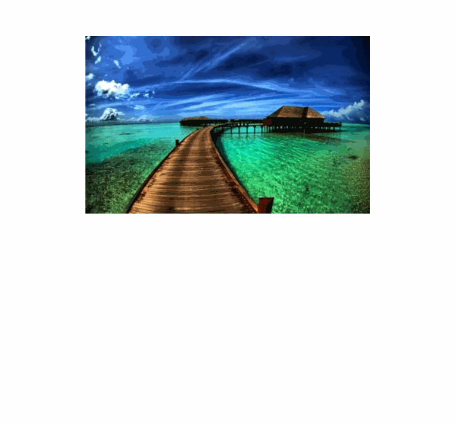

# microlite
An uber small 1kb lightbox

#### Purpose

A lightbox with no extras, no icons, looks nice, and is easy to use. Ideal for including it directly in your page on a as-needed basis.

It uses CSS multiple backgrounds to load in the high-res version on top of the low-res, making the experience fast and seamless.


#### Useage

Simply call the microLite function via onclick on your link to the larger full-size image.

```
<a href="[full-image.jpg]" onclick="microLite(this)">
  
</a>
```


#### Size

1,269 | 1,006
---|---
bytes | minified


#### Demo

[Try it out](http://output.jsbin.com/tebeve/)


